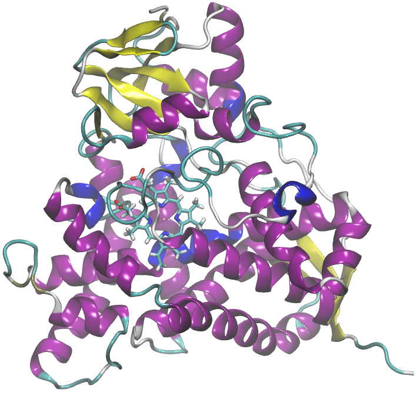

### Hi guys, welcome! 👋

  

## About Me
- 👨‍🎓 PhD student in Biotechnology at the Paulista State University, Brazil.
- 👨‍🎓 MSc in Biomaterials and Bioprocess Engineering at the Paulista State University, Brazil.
- 🚀 Research Programs in Aerospace Technologies in the ​​Biotechnology at the Hardware BR Institute, Brazil.
- 🔬 Working on Computational Chemistry, specifically Molecular Dynamics Simulations with Machine Learning, applying in the area of ​​thermodynamics properties.
- 💼 Research on the behavior of biomolecules in ionic liquids.
- 💼 Investigation of enzymatic decarboxylation for the production of drop-in bio-hydrocarbons, using Molecular Dynamics for thermodynamic property prediction.
- 📫 How to reach me: [patrick.faustino@unesp.br](mailto:patrick.faustino@unesp.br)
- 💬 I welcome discussions, consultations and collaboration opportunities in the areas of computational chemistry and molecular dynamics simulations. Feel free to contact me or if you would like to discuss possible cooperations.

## Contact

- 📧 Email1: [patrickfaustino@hotmail.com](patrickfaustino@hotmail.com)
- 📧 Email2: [professorpatrickfaustino@gmail.com](professorpatrickfaustino@gmail.com)
- 🐦 X: [@pkfaustino](https://x.com/pkfaustino)
- 🟢​ ORCID: [0000-0002-9323-2489](https://orcid.org/0000-0002-9323-2489)

## Keywords

- 🔑 Molecular dynamics; Biomolecules; Aqueous Biphasic Systems; Ionic Liquids; Drop-in Biofuels; Enzymatic Catalysis; Fatty Acid Decarboxylation; Thermodynamics Properties; Solvation; Phase Equilibrium.

## Workstation Home
- 🖥️ AMD Ryzen 9 5900XT (16/32) @ OC 4700 MHz with Water-Cooler 360 Kalkan and Corsair 4000D computer case; ASUS TUF Gaming X570 Plus; Corsair Dominator 2x16 GB DDR4 @ 3200 MT/s XMP2; MSI RTX 4070 Ti Gaming Trio X; Power Supply Energy Corsair RM1000e 1000 W.
- 🖥️ AMD Ryzen 7 2700X (8/16) @ OC 3900 MHz with Water-Cooler 240 Rise and Gamemax Fortress computer case; Biostar Racing X470GTA; Geil 2x16 GB DDR4 @ 3000 MT/s XMP2; AsRock RX 6600XT Challenger D; Power Supply Energy AeroCool KCAS 500 W.
- 🎖️ 53.4 TFLOPS Go!
- 🧬 Software suite molecular dynamics: Gromacs 2025/2026 and OpenMM 8

## Skills

## Learning
- 🐍 Python for Data Science: Getting Started. Alura, 2025.
- 🐍 Python for Data Science: Working with Functions, Data Structures, and Exceptions. Alura, 2025.
- 🐍 Numpy: efficient numerical analysis with Python. Alura, 2025.
- 🧠 Prompt Engineering: Creating Effective Prompts for Generative AI. Alura, 2025.
- 🧠 Gemini: Master Google's AI Assistant. Alura, 2026

## Tutorials, Thesis and Papers
🔥 [Look here!](https://github.com/patrickallanfaustino/tutorials-md)
