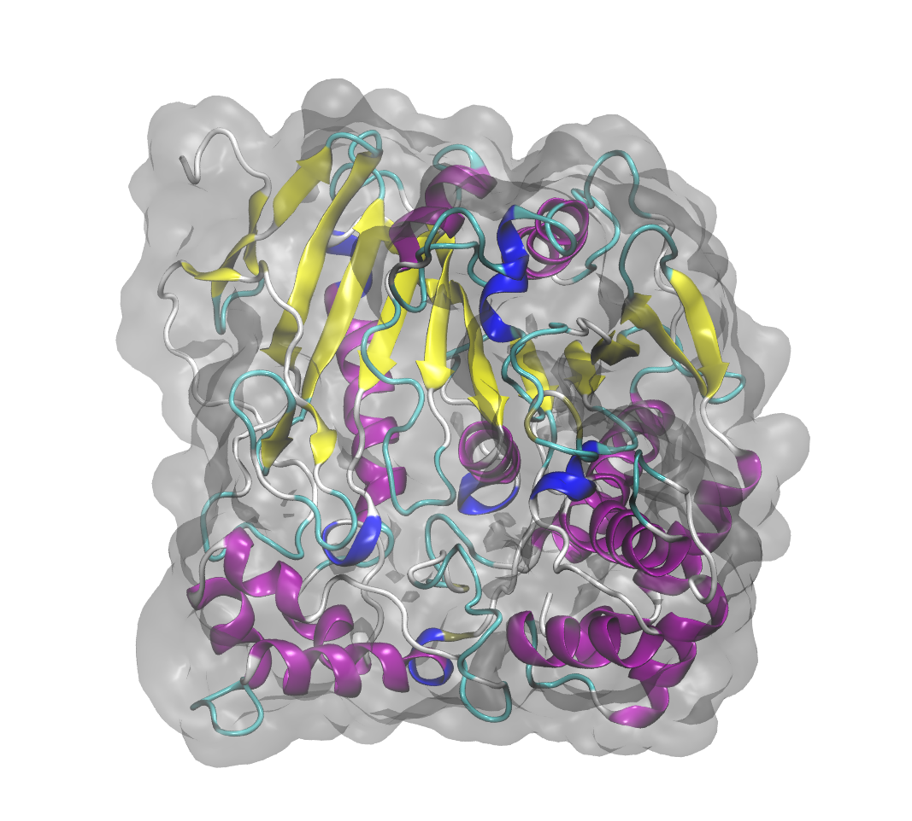

### Hi guys, welcome! 👋

  

## About Me
- 👨‍🎓 PhD student in Biotechnology at the Paulista State University, Brazil.
- 👨‍🎓 MSc in Biomaterials and Bioprocess Engineering at the Paulista State University, Brazil.
- 👨‍🎓 BSc student in Computer Engineering at the Virtual University of the State of São Paulo, Brazil.
- 🚀 Residency in Aerospace Technologies in the ​​Biotechnology at the Brazilian Space Agency, Brazil.
- 🔬 Working on Computational Chemistry, specifically Molecular Dynamics Simulations with Machine Learning.
- 💼 Researching the behavior of biomolecules in ionic liquids.
- 📫 How to reach me: [patrick.faustino@unesp.br](mailto:patrick.faustino@unesp.br)
- 💬 I welcome discussions, consultations and collaboration opportunities in the areas of computational chemistry and molecular dynamics simulations. Feel free to contact me or if you would like to discuss possible cooperations.

## Contact

- 📧 Email1: [patrickfaustino@hotmail.com](patrickfaustino@hotmail.com)
- 📧 Email2: [professorpatrickfaustino@gmail.com](professorpatrickfaustino@gmail.com)
- 🐦 X: [@pkfaustino](https://x.com/pkfaustino)
- 🟢​ ORCID: [0000-0002-9323-2489](https://orcid.org/0000-0002-9323-2489)
- 🟣 Web of Science: [LTD-8752-2024](https://www.webofscience.com/wos/author/record/LTD-8752-2024)

## Keywords

- 🔑 Molecular dynamics; Biomolecules; Aqueous Biphasic Systems; Ionic Liquids; Thermodynamics; Solvation; Complex Solutions.

## Workstation Home
- 🖥️ AMD Ryzen 9 5900XT @ OC 4800 MHz with Water-Cooler 360 Kalkan and Corsair 4000D computer case; TUF ASUS Gaming X570 Plus; Corsair Dominator 2x16 GB DDR4 @ 3200 MHz XMP2; AMD Radeon RX 6600 @ OC 2750 MHz with 8 GB VRAM @ 1900 MHz; NVME/SSD storage 3 TB; Power Supply Energy Corsair RM1000e 1000 W.
- 🎖️ 11.15 TFLOPS Go!
- 🧬 Software suite molecular dynamics: Gromacs 2025 and OpenMM 8

## Skills

## Learning
- 🐍 Python for Data Science: Getting Started. Alura, 2025.
- 🐍 Python for Data Science: Working with Functions, Data Structures, and Exceptions. Alura, 2025.
- 🐍 Numpy: efficient numerical analysis with Python. Alura, 2025.

## Tutorials, Thesis and Papers
🔥 [Look here!](https://github.com/patrickallanfaustino/tutorials-md)
